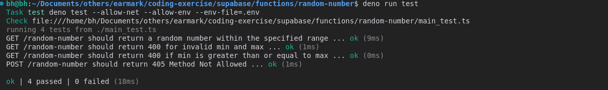
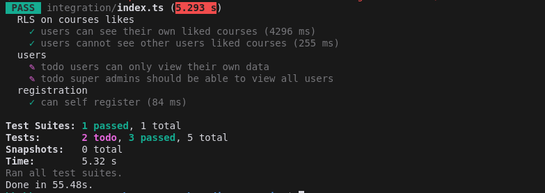
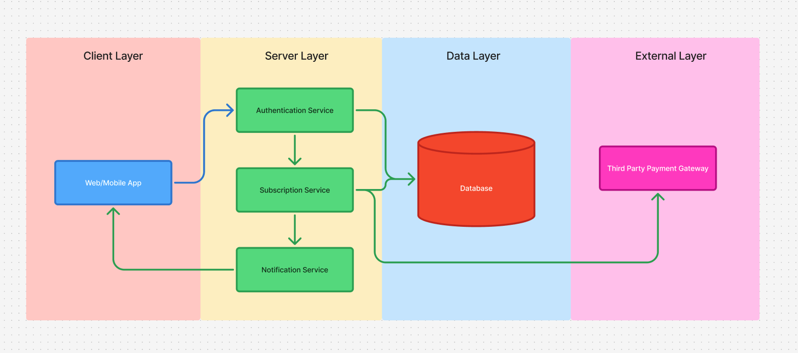

# Coding Exercise

Welcome to the Earmark coding exercise! This exercise is designed to test your ability to write clean, maintainable
code. We're looking for code that is well-organized, easy to read, and easy to understand. We're also looking for tests
that are thorough and well-organized.

## Domain

The domain for this exercise is a podcast app that allows users to listen to podcasts and earn CPE (Continuing
Professional Education) credits. The entities can be found inside the database schema.

## Instructions

1. **Fork the Repository** – Create a personal fork of this repository in your GitHub account.
2. **Complete the Tasks** – Refer to the
   [three issues in this repository](https://github.com/EarmarkCPE/coding-exercise/issues) and implement the required
   solutions.
3. **Submit Your Work** – Once all tasks are completed, share a link to your forked repository with us for review.
4. **Repository Deletion** – You will be required to delete your repository after we complete our evaluation.

Let us know if you have any questions. Good luck! 🚀

## Dev Setup

Follow the steps here to create your Supabase backend from the staging environment.

https://supabase.com/docs/guides/resources/supabase-cli/local-development

For development, all you need to do is [install the Supabase CLI](https://supabase.com/docs/guides/cli) and then run
`supabase start` in the root directory. _You don't have to run `supabase login` to start the project!_

Once supabase is started and running, it will print out some information. Make note of the `API URL`, the `anon key`,
and `service_role key`.

### Running the tests

These are integration tests and it will spin up Supabase automatically for you. Because of this, it is recommended to
run the tests in watch mode.

Copy the `@app/tests/.env.example` file to `@app/tests/.env`.

```bash
cp @app/tests/.env.example @app/tests/.env
```

Then run this at the root of the project:

```bash
yarn install
yarn test --watch
```

### FAQ

**Q: How do I test/debug RLS policies?**

**A:** This can be tested within a postgres transaction after setting a variable to emulate what supabase does during
their connections. Open a query console in DataGrip and run the following:

```postgresql
begin; -- Start the transaction
set role authenticated; -- Necessary to enable RLS policies otherwise none would
set local "request.jwt.claims" to '{ "sub": "5284a300-3a7a-4840-bb70-3d8dafa8d9a3", "email": "email@disca.tech" }'; -- Emulate a specific user
select auth.uid(); -- This should return the user id if working properly.
select * from users; -- An example of querying a table that might have RLS policies enabled
commit; -- End the transaction
```

```postgresql
begin;
set role postgres; -- Dont forget to set the role back if you changed it outside the transaction.
commit;
```

If you need to debug the actual RLS policies themselves, the easily way is to edit the method being called itself.

```postgresql
create or replace function public.owns_record(user_id uuid, out success boolean) returns boolean as $$
begin
    raise notice 'auth.uid %', user_id;
    raise notice 'user_id  %', user_id;
    select auth.uid() = user_id into success;
end;
$$ language plpgsql stable set search_path = pg_catalog, public, pg_temp;
```

## Github Issues resolved

### ✅ Issue 1 [New Serverless Function](https://github.com/EarmarkCPE/coding-exercise/issues/1)

    ✅ A Deno edge function is implemented that performs a simple operation (e.g., reversing a string, generating a random number, or formatting a timestamp).

    ✅ The function includes documentation explaining its purpose, expected input/output, and how to deploy it.

    ✅ The function is tested using Deno’s built-in test framework.

    ✅ Tests are written that prove the acceptance criteria above are met.



### ✅ Issue 2 [Add RLS Policy to Liked Courses](https://github.com/EarmarkCPE/coding-exercise/issues/2)

    ✅ A row-level security (RLS) policy is implemented on the courses_likes table, ensuring users can only view their own liked courses.

    ✅ A database migration is created to apply the new RLS policy.

    ✅ Tests are written to verify that:
    - ✅ A user can see their own liked courses.
    - ✅ A user cannot see another user's liked courses.

    ✅ Proof of work is provided (e.g., screenshots of tests passing, SQL query results demonstrating correct access control).

- Run the the following command in the root directory to run the tests.

  ```bash
  yarn test
  ```

  

### ✅ Issue 3 [Payment System Design](https://github.com/EarmarkCPE/coding-exercise/issues/3)

    ✅ A technical design document is created outlining how payment processing would be integrated into the application.

    ✅ The document includes:
    - A high-level payment flow using Stripe as the payment provider
    - Subscription management and recurring billing implementation
    - Access control based on subscription status
    - Error handling and payment failure scenarios

[Payment Processing Design Doc](./docs/payment_system_design.md)


