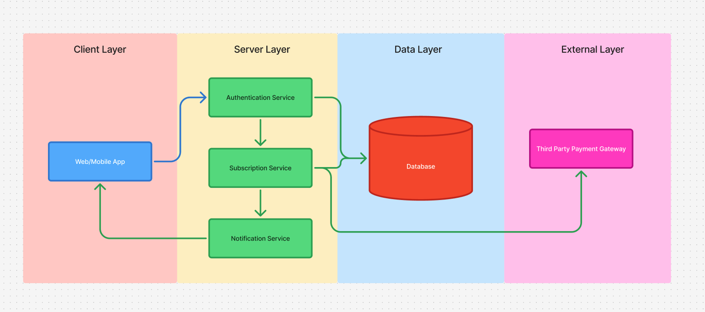

# Payment Processing System

## TL;DR
This document outlines the design for integrating a payment processing system to support per-user monthly subscriptions. The system aims to efficiently manage payments, user subscriptions and access control based on payment status.

## High Level Payment flow

### User Registration
- User signs up for the service.
- Collect user payment details (e.g., credit card, direct debit, etc.)

### Subscription Creation
- User selects a subscription plan.
- Input collected is sent to the payment processing provider.

### Payment Authorization
- Payment provider authorizes the payment.
- If authorized, a confirmation is sent back to the system.

### Subscription Activation
- Upon confirmation, activate the user's subscription in the system.
- Store subscription start date, plan details, and payment status.

### Recurring Payments
- At the end of each month, the system attempts to charge the user automatically.
- Notify the users about the payment status(success/failure).

### Subscription Management
- Users can view/update/cancel their subscription.
- The system automatically cancels the subscription if the user does not pay.

## Consideration of Payment Providers

### Key Requirements
- Security and reliability (Must comply with PCI DSS)
- Developer experience (Compatible with current tech stack)
- Cost effectiveness (Transaction fees, setup fees)
- Support for regions, currencies, and payment methods

### Recommended Providers

- [Stripe](https://stripe.com/)
  - Robust API/SDK and webhook based subscription management

- [PayPal](https://www.paypal.com/)
  - Alternative to Stripe, less developer friendly

- [In-App Purchase](https://developer.apple.com/in-app-purchase/)
  - Native iOS payment solution

- [Apple Pay](https://developer.apple.com/apple-pay/)
  - Seamless integration for Apple users

- [Google Pay](https://developers.google.com/pay/api)
  - Android payment integration

## A Strategy for Managing User Subscriptions

### DB Schema

#### User Table
- id (Primary Key)
- email 
- name
- payment_method_id
- created_at

#### Subscription Table
- id (Primary Key)
- user_id (Foreign Key)
- status (active, canceled, suspended)
- start_date
- end_date
- plan_type (monthly, yearly)

### Storage Considerations

- Use PostgreSQL for reliable financial data storage (Strong consistency).
- Indexing strategy for quick lookups.

## How access control would be handled based on payment status.
### Access Control and Subscription Lifecycle Management

| Event | Actions | Status Change |
|-------|---------|--------------|
| **Access Request** | - Check subscription status - Grant/deny access based on status - Log access attempt | Active → Full access Cancelled/Suspended → Restricted |
| **Payment Success** | - Update subscription record - Send welcome email - Enable premium features | Pending → Active |
| **Payment Failure** | - Attempt retry (3x) - Send failure notification - Restrict access after grace period | Active → Grace Period → Suspended |
| **Cancellation** | - Update end date - Send confirmation - Schedule access revocation | Active → Cancelled |
| **Billing Due** | - Send reminder (3-5 days prior) - Prepare renewal transaction - Update billing logs | No status change |

### Implementation Notes

1. **Real-time Status Checks**
   - Use Redis caching for fast subscription status lookups
   - Implement webhook handlers for payment provider events

2. **Audit Requirements**
   - Log all status changes with timestamps
   - Track payment attempts and failures
